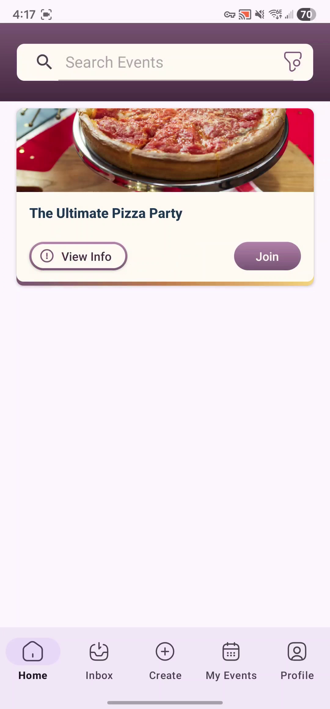

[](https://github.com/CMPUT301F25powder/Skeddly-powder/actions/workflows/test.yml)
[](https://github.com/CMPUT301F25powder/Skeddly-powder/actions/workflows/build.yml)
[](https://github.com/CMPUT301F25powder/Skeddly-powder/actions/workflows/pages/pages-build-deployment)

# Skeddly



## Description

Skeddly is an event hosting app where users can register to participate in events, and be selected via a fair lottery selection system.

In real life, many events have limited capacities. A single swim teacher cannot possibly teach hundreds of students at once! But then, how can we fairly choose those who can participate in our event? Traditionally, a first come first serve system could be employed. Anyone can register up until we've reached capacity, and too bad to anyone afterwards. However, this punishes those who may lead more busy lives. That's why we turn to our favourite technique. Lottery!

Skeddly allows fair selection of participants who sign up for events. Organizers can create events on the platform, and share them via a QR code to interested participants. Entrants can browse events and filter according to their interests. If an entrant is interested in an event, they can choose to sign up at any point during the registration period. When an organizer is ready, they can draw as many participants as needed from those who have signed up. Selected participants will be notified and asked to confirm their attendance. This system ensures fairness to anyone who is interested in the event and signs up during the registration period!

## Setup Steps

1. Clone the repository onto your computer.
2. Place your `google-services.json` file into the `Skeddly/app` folder.
3. Obtain a Maps SDK for Android key and set it in `secrets.properties`. The contents of this file should be:

```
MAPS_API_KEY=<your key>
```

If you do not perform this step, the app will still function. However, screens that show a map will not work correctly.

4. This project relies on Firebase Functions. You need to run `firebase deploy --only functions` inside of the `firebase` directory. Note that this requires the Blaze (PAYG) plan of Firebase. If you don't want to do that, you may also use the Firebase emulator by running `firebase emulators:start` inside of the `firebase` directory. Then, change the build variant inside of Android Studio by going to `build` -> `Select Build Variant`. By default, it will use the address `10.0.2.2` which is the default address for an Android emulator running on the same computer as the Firebase emulator. You can change this by creating a file `Skeddly/settings.properties` and adding the contents `EMULATOR_ADDRESS="10.0.2.2"` where you replace `10.0.2.2` with the address of your emulator.

5. Open the project in Android Studio, and deploy to an emulator or physical device of your choosing.

## Quick Links

- [Wiki](https://github.com/CMPUT301F25powder/Skeddly-powder/wiki)
- [Project Board](https://github.com/orgs/CMPUT301F25powder/projects/3)
